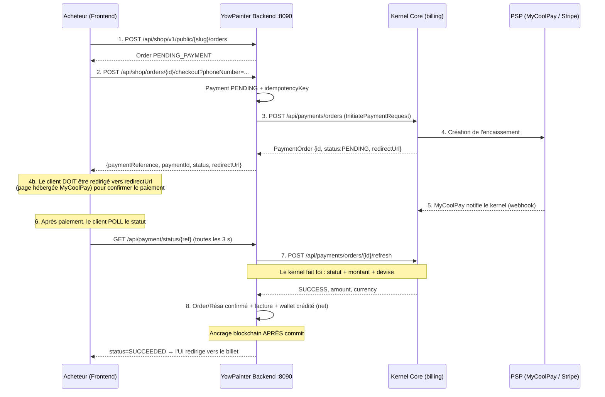

# Billing — Workflow de paiement et guide de test

Ce document décrit le flux de paiement **frontend → backend → kernel → PSP** et comment le tester bout en bout.

> **Règle d'or de l'architecture**
> Le frontend n'appelle **jamais** le kernel. Seul le backend YowPainter est une `ClientApplication` du kernel (il seul détient `X-Client-Id` / `X-Api-Key`).
> De même, **YowPainter n'appelle jamais un PSP** : c'est le kernel qui pilote MyCoolPay / Stripe. Aucun secret PSP ne vit dans ce dépôt.

---

## 1. État actuel — à lire avant de tester

| Couche | État | Détail |
|---|---|---|
| Backend ↔ Kernel | ✅ **Opérationnel** | Encaissement délégué à `/api/payments/orders`, callback vérifié, rattrapage par `refresh` |
| Frontend → Backend (commande) | ✅ Opérationnel | `/checkout` crée bien les commandes |
| Frontend → Backend (**paiement**) | ❌ **Non câblé** | La page `/checkout` collecte le numéro de téléphone mais **ne l'envoie jamais**. `checkoutOrder()` n'est appelé nulle part. Voir §6. |
| Retrait (payout) | ❌ Indisponible | Le kernel n'expose aucun endpoint de décaissement. `POST /api/wallet/withdraw` refuse **avant** tout mouvement. |

⚠️ **Il y a deux pages checkout dans le frontend.** Ne pas les confondre :

| Page | Fichier | Rôle |
|---|---|---|
| `/checkout` | `src/app/[locale]/(public)/checkout/page.tsx` | **La vraie** — crée les commandes via `placeOrder` |
| `/shop/checkout` | `src/app/[locale]/(public)/shop/checkout/page.tsx` | **Maquette** — le bouton « Confirmer le paiement » est un simple `<Link>` vers `/shop/confirmation`. Aucun appel réseau. Totaux codés en dur. |

**Conséquence pratique :** aujourd'hui, le paiement se teste **par API** (§5). Le parcours complet par l'UI nécessite le câblage du §6.

---

## 2. Vue d'ensemble du flux



> **Confirmation pilotée par le frontend (polling).** Le PSP notifie le **kernel** (pas nous). Notre backend ne l'apprend qu'en appelant `refresh`. On ne dépend donc pas d'un webhook entrant : après la redirection PSP, le frontend interroge `GET /api/payment/status/{referenceId}`, qui déclenche le `refresh` côté backend et applique l'issue (crédit wallet, confirmation réservation). Un `PaymentPollingService` sert de filet (toutes les 10 min) et l'endpoint public `/api/payment/callback` reste accepté si le kernel l'appelle — mais **le chemin nominal est le polling**.

### Comment MyCoolPay encaisse réellement — **redirection obligatoire**

Vérifié en direct sur le kernel déployé. `POST /api/payments/orders` avec `MYCOOLPAY` / `MOBILE_MONEY` (numéro valide, montant suffisant) renvoie :

```json
{ "status": "PENDING",
  "providerReference": "69950e88-...",
  "redirectUrl": "https://my-coolpay.com/payment/checkout/69950e88-..." }
```

⚠️ **Le paiement Mobile Money n'est PAS un push USSD automatique.** Le kernel crée l'ordre et renvoie une **`redirectUrl` (page hébergée MyCoolPay)**. Le payeur **doit être redirigé** vers cette page pour saisir/confirmer son numéro : c'est **là** que la demande de paiement part sur son téléphone. Sans redirection, l'ordre reste `PENDING`, le PSP n'envoie rien, et le solde de l'artiste ne bouge jamais.

Le backend expose déjà `redirectUrl` (via `PaymentInitiationResult` → payload du contrôleur). **C'est au frontend de la suivre.** L'UI ouvre la `redirectUrl` (nouvelle fenêtre), le payeur confirme, puis le frontend **poll** `GET /api/payment/status/{referenceId}` jusqu'à `SUCCEEDED`/`FAILED`.

**`callbackUrl` = page frontend de retour.** Le backend passe désormais `callbackUrl = FRONTEND_URL/payment/return?ref=...&type=...` (et non plus l'endpoint JSON du backend). Ainsi, quand le navigateur revient du PSP, il atterrit sur une **page frontend** (qui vérifie le statut / ferme la fenêtre), pas sur du JSON.

Conditions pour obtenir `PENDING` + `redirectUrl` (sinon `status: FAILED` immédiat, sans redirectUrl) :

| Condition | Constat (tests directs) |
|---|---|
| Montant | ≥ ~100 FCFA. `amount=1` → **FAILED** ; `amount=50` → OK |
| Numéro payeur | Format `237XXXXXXXXX` avec **préfixe camerounais valide** (MTN `67`/`650-654`/`680-684`, Orange `69`/`655-659`/`685-689`). `237600000000` (préfixe `60`) → **FAILED** |
| `STRIPE` / `CARD` | **FAILED** sur cette instance (Stripe non configuré / XAF non supporté) → utiliser `MYCOOLPAY` |

> Un `status: FAILED` renvoyé avec `success: true` (« Encaissement initié ») **n'est pas** une erreur HTTP : c'est le PSP qui a refusé d'initier. Le backend le marque `FAILED` et le frontend doit afficher un message clair (montant/numéro).

### Le point de sécurité central

`POST /api/payment/callback` est **public** (`SecurityConfig` → `permitAll`) : l'émetteur ne s'authentifie pas auprès de nous. Son contenu **n'est jamais une preuve de paiement** — il ne sert qu'à désigner *quelle* référence re-vérifier.

`PaymentService.verifyPaymentWithKernel()` reconfirme systématiquement auprès du kernel, et **refuse** si :

- le kernel ne confirme pas `SUCCESS` ;
- le **montant** diffère de la commande locale ;
- la **devise** diffère ;
- le paiement n'a pas d'ordre kernel associé ;
- **le kernel est injoignable** (un kernel muet ne valide jamais rien).

Un callback forgé est donc sans effet. Ce comportement est verrouillé par les tests (§7).

---

## 3. Prérequis

### 3.1 Configuration backend (`.env.local`)

```bash
# Kernel
KSM_KERNEL_BASE_URL=https://kernel-core.yowyob.com/kernel-api
KSM_KERNEL_CLIENT_ID=<votre client id>
KSM_KERNEL_API_KEY=<votre api key>
KSM_KERNEL_TENANT_ID=<votre tenant id>
KSM_KERNEL_DEFAULT_CURRENCY=XAF

# Compte admin kernel — utilisé pour les appels de paiement
KSM_KERNEL_BOOTSTRAP_ADMIN_USERNAME=platform-admin
KSM_KERNEL_BOOTSTRAP_ADMIN_PASSWORD=<mot de passe>

# URL publique du backend : transmise au kernel comme callbackUrl
BACKEND_URL=http://localhost:8090

# Paiement (aucun secret PSP ici)
PAYMENT_PROVIDER=MYCOOLPAY    # MYCOOLPAY (Mobile Money) | STRIPE (carte)
PAYMENT_METHOD=MOBILE_MONEY   # MOBILE_MONEY | CARD

PORT=8090
```

> **`BACKEND_URL` doit être joignable *depuis le kernel*.** En local, `http://localhost:8090` est inatteignable pour un kernel distant : le callback n'arrivera jamais. Deux options :
> - exposer le backend via un tunnel (`ngrok http 8090`) et mettre l'URL publique dans `BACKEND_URL` ;
> - ne rien exposer et s'appuyer sur le **rattrapage** (§8) ou déclencher le callback à la main (§5.5).

### 3.2 Données requises

Le paiement est rattaché à l'**organisation kernel de l'artiste** — c'est elle qui porte le schéma tenant et le portefeuille à créditer.

- Un **artiste** avec `status = ACTIVE` **et `organizationId` non nul** (provisionné via l'approbation admin — cf. `docs/ARTIST_APPROVAL_WORKFLOW.md`). Sans `organizationId`, l'initiation lève `IllegalStateException`.
- Un **produit** publié par cet artiste.
- Un **acheteur** avec le rôle `BUYER`.

### 3.3 Migrations

Les colonnes de liaison kernel (`kernel_order_id`, `idempotency_key`, `provider`, `method`, `redirect_url`) sont ajoutées par **Liquibase** :
`src/main/resources/db/changelog/tenant/V3__add_kernel_payment_order.sql` (schéma **tenant**).
Elles s'appliquent au démarrage. `ddl-auto: none` — aucune génération Hibernate.

---

## 4. Ce qui se passe dans chaque couche

### Étape 2 → 3 : initiation (`PaymentService.initiatePayment`)

1. Résout l'artiste par son slug → `organizationId`.
2. Positionne `OrganizationContext` **avant** d'ouvrir la transaction (le schéma tenant est résolu à l'ouverture — d'où l'absence volontaire de `@Transactional` sur la méthode).
3. Crée (ou reprend) la ligne `Payment` en `PENDING` avec une **clé d'idempotence stable** : `yowpainter-<type>-<referenceId>`.
4. Appelle le kernel **hors transaction** (pas de connexion DB tenue pendant l'aller-retour réseau).
5. Rattache `kernelOrderId`, `providerReference`, `redirectUrl` à la ligne locale.

**Idempotence :** relancer le checkout sur la même commande réutilise la même clé → le kernel ne crée pas un second encaissement. Un paiement déjà `SUCCEEDED` est refusé (`IllegalStateException`).

### Étape 6 → 8 : confirmation (`PaymentService.processSuccessfulPayment`)

1. Le callback arrive **sans contexte d'organisation** → balayage des tenants actifs pour localiser le paiement (la table `payment` n'existe que dans les schémas tenant).
2. Vérification auprès du kernel (`refresh`). En cas d'échec → paiement marqué `FAILED`, **aucun** effet de bord.
3. Si confirmé : `Payment` → `SUCCEEDED`, commande → `PAID` (+ `confirmOrder` kernel), facture créée et marquée payée, wallet artiste crédité du **net** (montant − commission selon le plan d'abonnement).
4. L'**ancrage blockchain** du mouvement de wallet est déclenché **après le commit** (`afterCommit`) : la chaîne étant irréversible, elle ne doit refléter que des mouvements définitivement validés.

---

## 5. Tester par API (possible dès maintenant)

Swagger backend : `http://localhost:8090/swagger-ui.html`
Swagger kernel : `https://kernel-core.yowyob.com/kernel-api/swagger-ui/index.html`

### 5.0 Démarrer et vérifier

```bash
./scripts/run-local.ps1        # ou : mvn spring-boot:run
curl http://localhost:8090/api/public/health
```

### 5.1 S'authentifier (acheteur)

```bash
TOKEN=$(curl -s -X POST http://localhost:8090/api/auth/login \
  -H "Content-Type: application/json" \
  -d '{"email":"acheteur@example.com","password":"<mot de passe>"}' \
  | jq -r '.accessToken')
echo "$TOKEN"
```

> Le champ est bien `accessToken` (cf. `AuthResponse`), pas `token`. Le JWT est émis par le kernel (RS256) ; YowPainter n'est que resource server.

### 5.2 Passer une commande

```bash
ORDER_ID=$(curl -s -X POST "http://localhost:8090/api/shop/v1/public/<artist-slug>/orders" \
  -H "Authorization: Bearer $TOKEN" \
  -H "Content-Type: application/json" \
  -d '{"productId":"<product-uuid>","quantity":1,"shippingAddress":"Douala, Cameroun"}' \
  | jq -r '.id')
echo "$ORDER_ID"
```

### 5.3 Déclencher le paiement — **le cœur du test**

```bash
curl -s -X POST "http://localhost:8090/api/shop/orders/$ORDER_ID/checkout?phoneNumber=237690000001" \
  -H "Authorization: Bearer $TOKEN" | jq
```

Réponse attendue :

```json
{
  "paymentReference": "<id de l'ordre kernel>",
  "paymentId": "<uuid du Payment local>",
  "status": "PENDING",
  "redirectUrl": "https://..."   // présent surtout en CARD/Stripe
}
```

**À vérifier dans les logs backend** — le client kernel trace chaque appel :

```
>>> KERNEL HTTP REQUEST START >>>
URL: https://kernel-core.yowyob.com/kernel-api/api/payments/orders
Method: POST
Payload: {"clientId":"...","serviceCode":"YOWPAINTER_ORDER","idempotencyKey":"yowpainter-order-<id>",...}
```

**Test d'idempotence :** rejouer exactement la même commande `curl`. Le `paymentReference` doit rester **identique** — aucun second encaissement.

### 5.4 Autres parcours de paiement

```bash
# Billet d'événement (BUYER ou ARTIST)
curl -X POST "http://localhost:8090/api/events/reservations/<reservation-id>/checkout?phoneNumber=237690000001" \
  -H "Authorization: Bearer $TOKEN"

# Abonnement artiste (ARTIST)
curl -X POST "http://localhost:8090/api/subscription/upgrade/checkout?plan=PRO&phoneNumber=237690000001" \
  -H "Authorization: Bearer $ARTIST_TOKEN"
```

### 5.5 Simuler la notification de paiement

Si le kernel ne peut pas joindre votre `BACKEND_URL` (cas local courant), déclenchez le callback à la main. **`external_reference` = l'id de la commande** (pas l'id du paiement) :

```bash
curl -X POST http://localhost:8090/api/payment/callback \
  -H "Content-Type: application/json" \
  -d "{\"status\":\"SUCCESSFUL\",\"reference\":\"psp-ref\",\"external_reference\":\"$ORDER_ID\"}"
```

> **Ceci ne « valide » rien par soi-même.** Le backend va interroger le kernel via `refresh`. Tant que le PSP n'a pas réellement encaissé, le kernel répondra `PENDING` et **le paiement passera `FAILED`** — c'est le comportement attendu, pas un bug. Pour aboutir à `SUCCEEDED`, il faut un encaissement réellement confirmé côté PSP (sandbox MyCoolPay/Stripe configuré dans le kernel).

### 5.6 Vérifier le résultat

```bash
# Historique acheteur (balaye tous les tenants)
curl -s http://localhost:8090/api/payment/history -H "Authorization: Bearer $TOKEN" | jq

# Solde et mouvements artiste
curl -s http://localhost:8090/api/wallet/balance      -H "Authorization: Bearer $ARTIST_TOKEN" | jq
curl -s http://localhost:8090/api/wallet/transactions -H "Authorization: Bearer $ARTIST_TOKEN" | jq

# Ancrage blockchain (ADMIN)
curl -s "http://localhost:8090/api/admin/blockchain/transactions?organizationId=<org-id>&chainCode=COMOPS_MAIN" \
  -H "Authorization: Bearer $ADMIN_TOKEN" | jq
```

Côté kernel, l'ordre est consultable directement :

```
GET  /api/payments/orders/{id}
POST /api/payments/orders/{id}/refresh
GET  /api/payments/orders?limit=20
```

---

## 6. Tester par l'UI — le câblage manquant

La page `/checkout` crée les commandes puis affiche « succès » **sans jamais initier le paiement**. Le numéro de téléphone est saisi, validé… et jamais transmis.

Dans `src/app/[locale]/(public)/checkout/page.tsx`, `handlePlaceOrder()` fait aujourd'hui :

```ts
for (const item of items) {
  const res = await ShopOrdersService.placeOrder(item.artistId, { ... });
  if (res.id) ids.push(res.id);
}
// ⛔ Rien ici : le paiement n'est jamais déclenché
setCompleted(true);
```

Le câblage à ajouter (`checkoutOrder` existe déjà dans le client généré `ShopOrdersService`) :

```ts
for (const item of items) {
  const res = await ShopOrdersService.placeOrder(item.artistId, { ... });
  if (!res.id) continue;
  ids.push(res.id);

  // Déclenche l'encaissement via le backend (qui délègue au kernel)
  const payment = await ShopOrdersService.checkoutOrder(res.id, phoneNumber);

  // MyCoolPay (Mobile Money ET carte) renvoie une redirectUrl vers sa page
  // hébergée : il FAUT la suivre pour que le payeur confirme et reçoive la
  // demande de paiement. Sans redirectUrl, l'encaissement a échoué à s'initier.
  if (payment.redirectUrl) {
    window.location.href = payment.redirectUrl;
    return;
  }
  throw new Error("Paiement non initié (montant min. 100 FCFA / numéro Mobile Money valide).");
}
```

> ⚠️ Ce snippet **n'est pas appliqué** : câbler le paiement dans l'UI est un changement de comportement produit (l'acheteur sera réellement débité). À valider avant application.

Deux points à traiter avec ce câblage :

1. **Panier multi-articles.** `placeOrder` crée **une commande par article** → donc *un encaissement par article*. Soit on accepte N paiements, soit il faut regrouper côté commande. À trancher.
2. **La page `/shop/checkout`** (maquette) doit être supprimée ou redirigée vers `/checkout`, pour éviter qu'un utilisateur « confirme un paiement » qui n'existe pas.

---

## 7. Vérifier les garanties de sécurité

Les tests unitaires encodent le contrat anti-fraude :

```bash
mvn -o test -Dtest=PaymentServiceTest
```

| Test | Garantie |
|---|---|
| `processSuccessfulPayment_whenKernelDoesNotConfirm_shouldRejectAndNotCredit` | Callback forgé → aucun crédit |
| `processSuccessfulPayment_whenKernelAmountDiffers_shouldRejectAndNotCredit` | Encaissement partiel → rejet |
| `processSuccessfulPayment_whenKernelUnreachable_shouldRejectAndNotCredit` | Kernel muet → rejet |
| `processSuccessfulPayment_whenNoKernelOrder_shouldRejectAndNotCredit` | Paiement non vérifiable → rejet |
| `initiatePayment_whenAlreadyPaid_shouldRefuse` | Pas de double encaissement |
| `initiatePayment_shouldCreateLocalPaymentAndDelegateToKernel` | Clé d'idempotence stable |

**Test manuel de forge** — le scénario à reproduire :

```bash
# Un attaquant tente de faire passer une commande pour payée
curl -X POST http://localhost:8090/api/payment/callback \
  -H "Content-Type: application/json" \
  -d "{\"status\":\"SUCCESSFUL\",\"reference\":\"fake\",\"external_reference\":\"$ORDER_ID\"}"
```

Attendu dans les logs :

```
ERROR ... Le kernel ne confirme pas le paiement <id> (statut kernel: PENDING).
ERROR ... Payment verification failed for reference: <id>. Possible fraud attempt.
```

→ commande **non** passée `PAID`, wallet **non** crédité.

---

## 8. Rattrapage automatique

`PaymentPollingService` s'exécute **toutes les 10 minutes** et rafraîchit auprès du kernel tout paiement `PENDING` depuis **plus de 5 minutes**. C'est le filet de sécurité si un callback se perd (réseau, redémarrage, `BACKEND_URL` injoignable).

Pour tester sans attendre : créer un paiement, patienter 5 min, observer les logs :

```
Rattrapage : le kernel confirme le paiement <id> (callback probablement perdu).
```

En développement local sans tunnel, **c'est le chemin nominal** : le callback n'arrive jamais, le polling fait le travail.

---

## 9. Dépannage

| Symptôme | Cause probable |
|---|---|
| `L'artiste <slug> n'a pas d'organisation kernel provisionnee` | Artiste non approuvé / `organizationId` nul → cf. `ARTIST_APPROVAL_WORKFLOW.md` |
| `Paiement non trouve pour la reference: <id>` | Aucun `Payment` pour cette commande (checkout jamais appelé), ou artiste non `ACTIVE` (le balayage des tenants ne parcourt que les artistes actifs) |
| `Paiement <id> sans ordre kernel associe` | L'appel kernel a échoué à l'initiation — regarder les logs `KERNEL HTTP RESPONSE ERROR` |
| `Kernel request failed` sur un HTTP 200 | Enveloppe `ApiResponse` appliquée à un endpoint **brut**. `/api/paiement` renvoie un `PaymentView` nu → utiliser `postRaw`/`putRaw`/`getRaw` de `KernelHttpClient` |
| Paiement bloqué en `PENDING` | Callback jamais reçu → `BACKEND_URL` injoignable depuis le kernel. Attendre le polling (§8) ou monter un tunnel |
| `status: FAILED` dès l'initiation (avec `success:true`) | Le PSP a refusé : montant < ~100 FCFA, ou numéro payeur sans préfixe camerounais valide. Corriger le prix du billet / le numéro |
| Solde artiste inchangé après un paiement réussi | La confirmation passe par le polling `GET /api/payment/status/{ref}` (ou le scheduler à 10 min). Vérifier que le frontend poll bien, et que l'artiste (propriétaire) est `ACTIVE` avec un `organizationId` |
| Après paiement, le navigateur atterrit sur une page JSON | `callbackUrl` pointait sur le backend. Corrigé : il pointe sur `FRONTEND_URL/payment/return`. Vérifier que `FRONTEND_URL` est correct côté backend |
| `403/500` sur `GET /api/payment/status/{ref}` | L'appelant n'est pas le payeur (contrôle de propriété) ou le paiement est introuvable dans les tenants actifs |
| `Le retrait vers Mobile Money n'est pas encore disponible` | Attendu : aucun endpoint de décaissement kernel |

### Deux pièges du swagger kernel — ne pas « corriger » le code

1. **`/api/paiement` (billing legacy) renvoie un `PaymentView` brut**, sans enveloppe `ApiResponse` — contrairement à `/api/payments/orders` et `/api/v1/blockchain/*` qui sont enveloppés. D'où les variantes `*Raw` du client HTTP.
2. **`WalletResponse` est une collision de noms springdoc** : le swagger n'en expose qu'un seul (`ownerId`, `balance` — le wallet *billing*), alors que le wallet *blockchain* est `{organizationId, label, publicKey, fingerprint, active}`. `KernelWalletResponseDto` suit le **vrai** contrat blockchain, vérifié dans la source du kernel. L'aligner sur le swagger le casserait.

---

## 10. Limites connues

- **Valeurs de `status` du kernel non confirmées.** Le contrat `/api/payments/orders` provient du swagger ; ce module n'est pas présent dans la copie locale `KSM_Kernel_Layer/`, il n'a donc pas pu être recoupé avec la source. `KernelPaymentOrderResponseDto.isSucceeded()` tolère `SUCCESS | SUCCEEDED | COMPLETED | PAID` et `isFailed()` tolère `FAILED | CANCELLED | CANCELED | EXPIRED | REJECTED`. **À confirmer au premier paiement réel** et à resserrer ensuite.
- **Décaissement impossible** : pas d'endpoint kernel. Le solde wallet est acquis mais non retirable.
- **Wallet local vs wallet kernel** : le solde est tenu localement (+ ancrage blockchain), alors que le kernel expose aussi `/api/payments/wallets` (solde, `recharge`, `pay`, `can-operate`). Les deux modèles coexistent — arbitrage d'architecture à faire.
- **Client TypeScript non régénéré** : `checkoutOrder` renvoie désormais `paymentId`, `status` et `redirectUrl` en plus de `paymentReference`. Le type généré reste `Record<string, string>`, donc rien ne casse, mais régénérer le client rendrait ces champs explicites.

---

## Références

- `docs/KERNEL_INTEGRATION.md` — architecture et flux métier kernel
- `docs/CONFIGURATION_KERNEL_YOWPAINTER.md` — configuration détaillée des deux côtés
- `docs/ARTIST_APPROVAL_WORKFLOW.md` — provisioning de l'organisation artiste
- Swagger kernel : <https://kernel-core.yowyob.com/kernel-api/swagger-ui/index.html>
