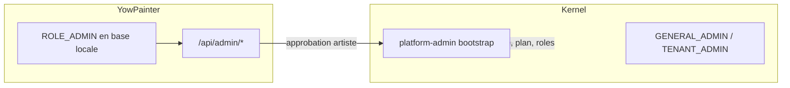

# Fiche des permissions — Rôle Administrateur (`ROLE_ADMIN`)

Ce document décrit ce qu'un **administrateur YowPainter** peut et ne peut pas faire, tel qu'implémenté dans le backend.

> Voir aussi : [ARTIST_APPROVAL_WORKFLOW.md](./ARTIST_APPROVAL_WORKFLOW.md) · [testing.md](./testing.md) · [CONFIGURATION_KERNEL_YOWPAINTER.md](./CONFIGURATION_KERNEL_YOWPAINTER.md)

---

## 1. Deux niveaux de « admin »

YowPainter distingue **deux autorités** complémentaires :

| Niveau | Identifiant | Où | Rôle |
|--------|-------------|-----|------|
| **Admin YowPainter** | `ROLE_ADMIN` | Base locale `public.app_user.role` | Accès aux routes `/api/admin/**` |
| **Admin Kernel** | `GENERAL_ADMIN` ou `TENANT_ADMIN` | Kernel IAM (assigné à l'inscription admin) | Droits administratifs côté Kernel tenant |



**Important :** lors de l'approbation d'un artiste, le backend **n'utilise pas** le JWT de l'admin connecté pour parler au Kernel. Il utilise le compte technique **`platform-admin`** (`KSM_KERNEL_BOOTSTRAP_ADMIN_*`). Le rôle `ROLE_ADMIN` YowPainter autorise l'**appel API** ; le provisioning Kernel est exécuté en arrière-plan via bootstrap.

---

## 2. Conditions d'accès

Pour être reconnu comme admin :

1. **Profil local** — ligne dans `public.app_user` avec `role = ROLE_ADMIN` (créée automatiquement au **`POST /api/admin/auth/login`** si absente)
2. **JWT Kernel valide** — obtenu via `POST /api/admin/auth/login`
3. **`kernel_user_id`** renseigné (liaison avec le compte Kernel)

Le login **`POST /api/admin/auth/login`** crée ou met à jour le profil admin local après authentification Kernel. Le login public **`POST /api/auth/login`** ne fait pas cette promotion.

### Inscription admin

| Endpoint | Accès | Description |
|----------|-------|-------------|
| `POST /api/admin/auth/register` | Public (non authentifié) | Crée compte Kernel `PROSPECT` + rôle `GENERAL_ADMIN`/`TENANT_ADMIN` + profil local |
| `POST /api/admin/auth/login` | Public | Connexion (même moteur que `/api/auth/login`) |

> L'inscription publique via `POST /api/auth/register` **interdit** le rôle `ROLE_ADMIN`.

---

## 3. Permissions exclusives — routes `/api/admin/**`

Toutes les routes ci-dessous exigent `@PreAuthorize("hasRole('ADMIN')")` et un header :

```http
Authorization: Bearer <accessToken>
```

### 3.1 Validation des artistes

| Méthode | Route | Permission | Action métier |
|---------|-------|------------|---------------|
| `GET` | `/api/admin/artists/pending` | Lire | Lister les artistes en attente (`status = PENDING_APPROVAL`) |
| `POST` | `/api/admin/artists/{id}/approve` | Écrire | Approuver un artiste et lancer le provisioning Kernel |
| `POST` | `/api/admin/artists/{id}/approve/confirm` | Écrire | Confirmer le code MFA bootstrap si requis |
| `POST` | `/api/admin/artists/{id}/reject` | Écrire | Refuser une demande (`status = REJECTED`) |

**Effets de l'approbation** (via `KernelArtistProvisioningService`, token `platform-admin`) :

- Création ou réutilisation de l'organisation Kernel (`FREELANCE`)
- Approbation organisation (`POST /api/organizations/{id}/approve`)
- Application du plan commercial `COMMERCE`
- Attribution du rôle `ORGANIZATION_ADMIN` à l'artiste
- Passage local `artist.status` → `ACTIVE`
- Création du schéma PostgreSQL `tenant_<organization_id>`

**Body optionnel — approve :**

```json
{
  "bootstrapMfaCode": "123456",
  "kernelActorId": "uuid-acteur-kernel"
}
```

### 3.2 Gestion des tenants (artistes)

| Méthode | Route | Permission | Action métier |
|---------|-------|------------|---------------|
| `GET` | `/api/admin/tenants` | Lire | Liste tous les artistes (id, nom, slug, status, email) |
| `PATCH` | `/api/admin/tenants/{id}/status` | Écrire | Modifier le statut local d'un artiste (`?status=ACTIVE|SUSPENDED|…`) |

> La modification de statut est **locale uniquement** — elle ne suspend pas automatiquement l'organisation Kernel.

### 3.3 Gestion des utilisateurs

| Méthode | Route | Permission | Action métier |
|---------|-------|------------|---------------|
| `GET` | `/api/admin/users` | Lire | Liste tous les utilisateurs (artistes, acheteurs, admins) |
| `DELETE` | `/api/admin/users/{id}` | Écrire | Supprime l'utilisateur en **base locale uniquement** |

> La suppression **ne supprime pas** le compte Kernel IAM.

### 3.4 Statistiques et audit

| Méthode | Route | Permission | Action métier |
|---------|-------|------------|---------------|
| `GET` | `/api/admin/stats` | Lire | Statistiques globales (tenants, users ; ventes = stub `0.0`) |
| `GET` | `/api/admin/logs` | Lire | **Mock** — retourne « Fonctionnalité en cours de développement » |

### 3.5 Profil admin

| Méthode | Route | Permission | Action métier |
|---------|-------|------------|---------------|
| `GET` | `/api/admin/me` | Lire | Email et rôle de l'admin connecté |

---

## 4. Ce que l'admin **ne peut pas** faire

Les routes métier artiste/acheteur exigent des rôles **spécifiques**. Un admin (`ROLE_ADMIN` seul) **n'y a pas accès** :

| Domaine | Rôle requis | Exemples bloqués pour l'admin |
|---------|-------------|-------------------------------|
| Artiste | `ROLE_ARTIST` | `POST /api/artworks`, `GET /api/artist/me`, wallet, boutique vendeur |
| Acheteur | `ROLE_BUYER` | `GET /api/buyer/me`, `POST /api/orders` |
| Mixte | `ARTIST` ou `BUYER` | Likes, commentaires, participations événements |

→ Réponse typique : **403 Forbidden**

L'admin **ne remplace pas** le compte `platform-admin` Kernel :

- Pas d'accès direct aux endpoints Kernel admin (`/api/administration/*`) avec son propre JWT
- Le MFA bootstrap est requis pour le provisioning artiste (code e-mail `platform-admin`)

L'admin **ne peut pas** :

- Créer des œuvres ou des commandes au nom d'un artiste
- Modifier le catalogue d'un tenant sans se connecter comme artiste
- Voir les logs d'audit réels (non implémenté)
- Obtenir un reporting ventes fiable (`total_sales_volume` = placeholder)

---

## 5. Ce que l'admin **peut** faire en plus (accès public)

Comme tout utilisateur authentifié ou anonyme, l'admin accède aux routes **publiques** :

| Type | Exemples |
|------|----------|
| Public | `GET /api/artworks`, `GET /api/public/health`, `GET /api/files/{id}` |
| Auth général | `POST /api/auth/logout`, refresh token |
| Profil / fichiers | `POST /api/me/profile-picture` (si profil local lié) |

---

## 6. Matrice récapitulative des rôles

| Capacité | Admin | Artiste | Acheteur | Public |
|----------|:-----:|:-------:|:--------:|:------:|
| Approuver / refuser artistes | ✅ | ❌ | ❌ | ❌ |
| Lister / gérer tenants | ✅ | ❌ | ❌ | ❌ |
| Lister / supprimer users locaux | ✅ | ❌ | ❌ | ❌ |
| Stats plateforme | ✅ | ❌ | ❌ | ❌ |
| Créer / vendre des œuvres | ❌ | ✅ | ❌ | ❌ |
| Acheter / commander | ❌ | ❌ | ✅ | ❌ |
| Parcourir le catalogue | ✅ | ✅ | ✅ | ✅ |
| Provisioning Kernel org/plan | ✅ (via bootstrap) | ❌ | ❌ | ❌ |

---

## 7. Rôles Kernel liés à l'admin YowPainter

À l'inscription (`KernelAdminRegistrationService`) :

1. Sign-up Kernel : `accountType = PROSPECT`
2. Assignation rôle administratif tenant : **`GENERAL_ADMIN`** (prioritaire) ou **`TENANT_ADMIN`**
3. Scope : **`TENANT`** (tenant YowPainter)

Marqueurs reconnus dans le JWT Kernel (`KernelAuthorityMapper`) :

- `ROLE_GENERAL_ADMIN`
- `ROLE_TENANT_ADMIN`
- `ROLE_SYSTEM_ADMIN`
- `ROLE_IAM_ADMIN`

Si présents dans le JWT, Spring mappe aussi `ROLE_ADMIN` pour la sécurité — mais **la source de vérité reste** `app_user.role` en base locale pour la réponse login et la résolution du profil.

---

## 8. Workflow type — admin en production

```
1. POST /api/admin/auth/login          → JWT + role ROLE_ADMIN (si profil local OK)
2. GET  /api/admin/artists/pending     → artistes en attente
3. POST /api/admin/artists/{id}/approve
      → si MFA_REQUIRED : POST .../approve/confirm { "mfaCode": "..." }
4. Artiste passe ACTIVE + org Kernel provisionnée
5. GET  /api/admin/tenants             → vérification
6. GET  /api/admin/stats               → vue d'ensemble
```

---

## 9. Dépannage permissions

| Symptôme | Cause | Action |
|----------|-------|--------|
| Login admin → `role: ROLE_BUYER` | Ancienne version backend ou login via `/api/auth/login` au lieu de `/api/admin/auth/login` | Redéployer et utiliser **`POST /api/admin/auth/login`** |
| `403` sur `/api/admin/*` | JWT valide mais sans `ROLE_ADMIN` Spring | Vérifier `app_user.role` et reconnecter |
| Liste pending vide | Statut artiste = `ORGANIZATION_VALIDATION_REQUIRED` au lieu de `PENDING_APPROVAL` | `UPDATE artist SET status = 'PENDING_APPROVAL'` ou corriger le filtre backend |
| Approve → erreur MFA | Bootstrap `platform-admin` requiert MFA | Fournir `bootstrapMfaCode` ou `approve/confirm` |
| Approve → acteur introuvable | `kernel_actor_id` absent | Passer `kernelActorId` dans le body approve |

---

## 10. Fichiers source de référence

| Fichier | Contenu |
|---------|---------|
| `AdminController.java` | Routes et garde `hasRole('ADMIN')` |
| `AdminService.java` | Logique tenants / users / stats |
| `ArtistApprovalService.java` | Approbation artiste + MFA |
| `KernelAdminRegistrationService.java` | Inscription admin |
| `SecurityConfig.java` | Routes publiques vs authentifiées |
| `KernelAuthorityMapper.java` | Mapping rôles Kernel → Spring |
