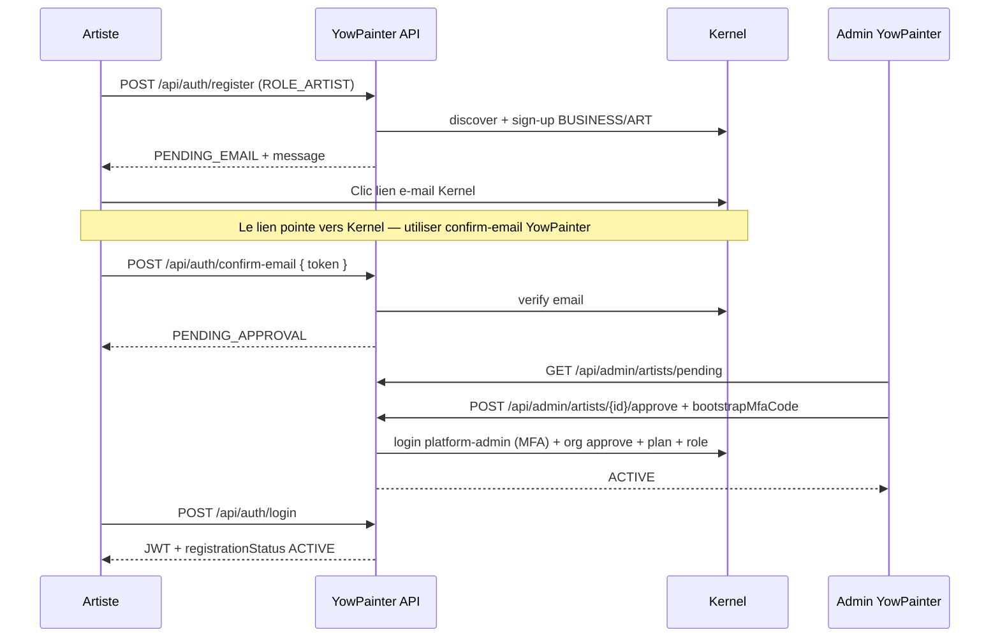

# Flux de validation artiste (manuel)

Ce document décrit le parcours **artiste** lorsque le provisioning Kernel est **désactivé** côté backend (`KSM_KERNEL_AUTO_PROVISION_ARTISTS=false`, valeur par défaut en prod).

> Voir aussi : [CONFIGURATION_KERNEL_YOWPAINTER.md](./CONFIGURATION_KERNEL_YOWPAINTER.md) · [KERNEL_INTEGRATION.md](./KERNEL_INTEGRATION.md)

## Configuration

```bash
# .env.local — prod recommandé
KSM_KERNEL_AUTO_PROVISION_ARTISTS=false

KSM_KERNEL_BOOTSTRAP_ADMIN_USERNAME=platform-admin
KSM_KERNEL_BOOTSTRAP_ADMIN_PASSWORD=...
KSM_KERNEL_BOOTSTRAP_CLIENT_ID=prod-platform-backend
KSM_KERNEL_BOOTSTRAP_API_KEY=...
```

| Variable | Effet |
|----------|--------|
| `KSM_KERNEL_AUTO_PROVISION_ARTISTS=false` | L'artiste reste en `PENDING_APPROVAL` après confirmation e-mail ; seul un admin YowPainter peut activer l'espace |
| `KSM_KERNEL_AUTO_PROVISION_ARTISTS=true` | Comportement legacy : tentative de provisioning auto au login / confirm (nécessite MFA bootstrap résolu) |

## Statuts locaux (`artist.status`)

| Statut | Signification |
|--------|----------------|
| `PENDING_EMAIL` | Inscription OK, e-mail Kernel non confirmé |
| `PENDING_APPROVAL` | E-mail confirmé, en attente de validation équipe |
| `ACTIVE` | Approuvé + org Kernel provisionnée (plan COMMERCE, rôle ORGANIZATION_ADMIN) |
| `REJECTED` | Demande refusée par un admin |

Le champ `registrationStatus` des réponses auth (`POST /api/auth/register`, `/login`, `/confirm-email`) reprend ce statut pour les artistes.

## Parcours utilisateur



### Étapes détaillées

1. **Inscription** — `POST /api/auth/register` avec `role: ROLE_ARTIST`.
2. **Confirmation e-mail** — `POST /api/auth/confirm-email` avec le token reçu (ne pas s'appuyer uniquement sur la redirection Kernel).
3. **Attente** — L'artiste voit `PENDING_APPROVAL` ; il peut se connecter mais son espace n'est pas encore actif côté commerce.
4. **Validation admin** — Un admin connecté (`ROLE_ADMIN`) approuve via l'API admin.
5. **Activation** — Statut `ACTIVE` ; l'artiste accède à son tenant / org Kernel.

## API admin (backend)

Toutes les routes exigent un JWT admin (`Authorization: Bearer …`, rôle `ROLE_ADMIN`).

### Lister les demandes en attente

```http
GET /api/admin/artists/pending
```

Réponse (extrait) :

```json
[
  {
    "id": "uuid-local",
    "email": "artiste@example.com",
    "firstName": "Landry",
    "lastName": "Lanslo",
    "artistName": "Landry Lanslo",
    "slug": "lanslo-47d14",
    "status": "PENDING_APPROVAL",
    "kernelUserId": "uuid-kernel-user",
    "kernelActorId": "uuid-kernel-actor",
    "organizationId": null,
    "tenantId": "11111111-1111-1111-1111-111111111111",
    "createdAt": "2026-06-13T10:00:00"
  }
]
```

### Approuver

```http
POST /api/admin/artists/{id}/approve
Content-Type: application/json

{
  "bootstrapMfaCode": "123456",
  "kernelActorId": "05e9045d-e38c-4fea-ad15-1a32b8d2544d"
}
```

| Champ | Obligatoire | Description |
|-------|-------------|-------------|
| `bootstrapMfaCode` | Oui en prod | Code MFA e-mail du compte `platform-admin` (client bootstrap) |
| `kernelActorId` | Non si déjà en base | UUID acteur Kernel ; requis si absent du profil local |

Le backend exécute alors (logs `[provision]`) :

1. Login bootstrap admin (+ MFA)
2. Création org si absente (`POST /api/organizations`)
3. Approbation org (`POST /api/organizations/{id}/approve`)
4. Plan commercial (`COMMERCE` par défaut)
5. Rôle `ORGANIZATION_ADMIN` pour l'utilisateur Kernel de l'artiste

### Refuser

```http
POST /api/admin/artists/{id}/reject
Content-Type: application/json

{ "reason": "Profil incomplet" }
```

## Pages frontend à prévoir

| Page / zone | Rôle | Comportement |
|-------------|------|--------------|
| Inscription artiste | Public | Message : « Vérifiez votre e-mail, puis notre équipe validera votre demande » |
| Confirm e-mail | Public | Appeler `POST /api/auth/confirm-email` ; afficher écran « Demande en cours de validation » si `PENDING_APPROVAL` |
| Connexion artiste | Artiste | Si `registrationStatus === 'PENDING_APPROVAL'` → bannière « En attente de validation » (pas de blocage login) |
| Dashboard admin — file d'attente | Admin | `GET /api/admin/artists/pending` : tableau avec nom, e-mail, slug, date |
| Modal approbation | Admin | Champ code MFA bootstrap + bouton Approuver → `POST …/approve` |
| Modal refus | Admin | Motif optionnel → `POST …/reject` |
| Détail tenant (existant) | Admin | Lien depuis la file vers fiche artiste / tenant |

### Exemple UX approbation

1. Admin ouvre « Demandes artistes ».
2. Clic « Approuver » → modal « Saisissez le code reçu par e-mail (compte platform-admin) ».
3. Soumission → spinner → toast succès ou message d'erreur Kernel.
4. Rafraîchir la liste pending.

## MFA bootstrap (prod)

En production, `platform-admin` exige un MFA e-mail. Le backend **ne peut pas** deviner le code : l'admin YowPainter doit :

1. Déclencher l'approbation (première tentative sans code peut échouer).
2. Consulter la boîte e-mail du compte bootstrap.
3. Renvoyer la requête avec `bootstrapMfaCode`.

Alternative long terme : compte de service sans MFA dédié au provisioning backend (accord équipe Kernel).

## Test rapide (curl)

```bash
# 1. Lister pending (JWT admin)
curl -s -H "Authorization: Bearer $ADMIN_JWT" \
  http://localhost:8090/api/admin/artists/pending

# 2. Approuver
curl -s -X POST -H "Authorization: Bearer $ADMIN_JWT" \
  -H "Content-Type: application/json" \
  -d '{"bootstrapMfaCode":"123456"}' \
  http://localhost:8090/api/admin/artists/{artistId}/approve
```

## Compte test connu

| Champ | Valeur |
|-------|--------|
| E-mail | `landrylanslo@gmail.com` |
| Statut attendu | `PENDING_APPROVAL` (e-mail déjà vérifié) |
| `kernelActorId` | `05e9045d-e38c-4fea-ad15-1a32b8d2544d` |

## Dépannage

| Symptôme | Cause probable | Action |
|----------|----------------|--------|
| 400 « acteur kernel introuvable » | `kernelActorId` absent | Passer `kernelActorId` dans le body approve |
| 400 « MFA requis » | Pas de `bootstrapMfaCode` | Saisir le code e-mail platform-admin |
| Artiste reste `PENDING_APPROVAL` après login | Normal en mode manuel | Attendre approbation admin |
| Logs `[provision] BOOTSTRAP_ADMIN_LOGIN — ECHEC` | Credentials bootstrap ou MFA | Vérifier `.env.local` bootstrap client/key |
